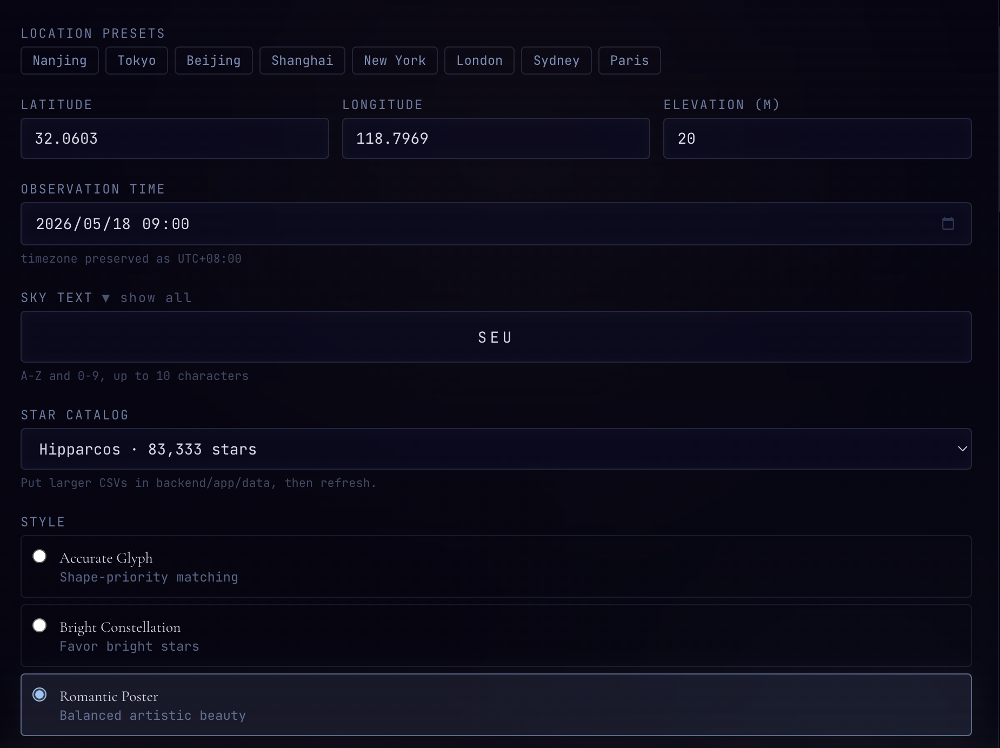
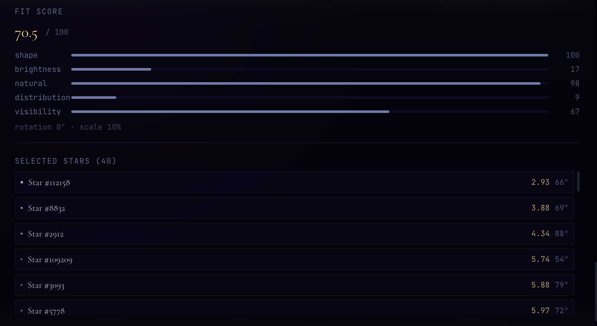

# Sky Glyph ✦

> *Written by real stars.*

Sky Glyph is a real-sky-driven character art generator. You input a location, a time, and a single character — the system computes the actual visible stars at that moment, then selects a subset of those real stars and connects them to form your character as a natural constellation.

**Romantic and scientific at the same time.**

---

## Visual Preview

Sky Glyph is not just a data dashboard. It renders real visible stars into a poster-like celestial scene, with local landscape silhouettes, glowing selected stars, animated constellation lines, and romantic generated captions.

### Generated Posters

The following images are real visual outputs from the current project UI.


### Interface

The control panel lets you choose location, time, text, star catalog, matching style, and glyph font.



The result panel shows the fit score, score breakdown, and the selected real stars used to write the glyph.



---

## Features

- 🌟 Real star positions via **Astropy** (RA/Dec → Alt/Az coordinate transforms)
- 🔡 Character matching for **A-Z and 0-9**
- ✍️ Text glyphs up to **10 characters** laid out in sequence
- 🎨 Three artistic styles: *Accurate Glyph*, *Bright Constellation*, *Romantic Poster*
- 🖼 Export as **poster PNG** with "Written by real stars above [location]" text
- 🔭 Hipparcos-compatible: swap in the full catalog CSV without changing any code
- ✨ Interactive star tooltips, multiple candidates, real-time magnitude filtering

---

## Architecture

```
sky-glyph/
├── backend/              # Python FastAPI
│   ├── app/
│   │   ├── main.py               # FastAPI routes
│   │   ├── catalog_loader.py     # CSV star catalog
│   │   ├── coordinate_transform.py  # Astropy RA/Dec → Alt/Az
│   │   ├── projection.py         # Alt/Az → canvas 2D
│   │   ├── visible_star_service.py  # Visible star filter
│   │   ├── glyph_template.py     # A-Z, 0-9 skeleton templates
│   │   ├── glyph_matcher.py      # Spatial search & matching
│   │   ├── scoring.py            # Multi-factor scoring
│   │   ├── models/
│   │   │   └── schemas.py        # Pydantic models
│   │   └── data/
│   │       └── stars_sample.csv  # 200-star sample catalog
│   ├── requirements.txt
│   └── run.py
│
└── frontend/             # React + TypeScript + Vite
    ├── src/
    │   ├── App.tsx
    │   ├── components/
    │   │   ├── ControlPanel.tsx
    │   │   ├── SkyCanvas.tsx
    │   │   ├── StarInfoPanel.tsx
    │   │   ├── GlyphPreview.tsx
    │   │   └── ExportPosterButton.tsx
    │   ├── utils/
    │   │   ├── api.ts
    │   │   └── canvas.ts
    │   └── types/index.ts
    ├── package.json
    └── vite.config.ts
```

---

## Quick Start

### macOS prerequisites

Install Node.js and Python tooling first:

```bash
# Option A: Homebrew
brew install node python

# Check versions
node -v
npm -v
python3 --version
```

If `npm -v` says `command not found`, the frontend cannot run yet. Install Node.js from Homebrew or <https://nodejs.org/>.

### Backend

```bash
cd backend

# Create virtual environment (recommended)
python3 -m venv .venv
source .venv/bin/activate     # macOS/Linux
# .venv\Scripts\activate      # Windows

# Install dependencies
pip install -r requirements.txt

# Run server
python run.py
# → http://localhost:8000
# → Docs at http://localhost:8000/docs
```

Keep this terminal open. The frontend talks to this server through Vite's `/api` proxy.

### Frontend

Open a second terminal:

```bash
cd frontend

# Install dependencies
npm install

# Start dev server (proxies /api to localhost:8000)
npm run dev
# → http://localhost:5173
```

Open `http://localhost:5173` in the browser. Do not double-click `frontend/index.html`; Vite must serve the React app and proxy API requests.

### If the page is blank

1. Make sure both servers are running:
   - Backend: `http://localhost:8000/docs`
   - Frontend: `http://localhost:5173`
2. Open browser DevTools Console. Common causes:
   - `npm: command not found`: Node.js is not installed.
   - `Cannot reach the Sky Glyph backend`: backend is not running.
   - `Only N visible stars found`: use `maxMagnitude` 9-10 or lower `minAltitude` to 0-5.
3. The sample catalog is intentionally small. Some locations/times may not have enough visible sample stars for every glyph. A fuller Hipparcos CSV makes matching much better.

### One-command Docker option

If you have Docker Desktop:

```bash
docker compose up --build
```

Then open the frontend URL shown by Docker, usually `http://localhost:5173` or the mapped port in `docker-compose.yml`.

---

## API

### `POST /api/sky`

Get all visible stars for a location and time.

```json
{
  "latitude": 35.6762,
  "longitude": 139.6503,
  "elevation": 40,
  "datetime": "2026-05-17T20:00:00+08:00",
  "maxMagnitude": 8.0,
  "minAltitude": 5.0,
  "catalog": "sample"
}
```

### `POST /api/glyph`

Generate a star glyph for a character.

```json
{
  "latitude": 35.6762,
  "longitude": 139.6503,
  "elevation": 40,
  "datetime": "2026-05-17T20:00:00+08:00",
  "char": "A",
  "catalog": "sample",
  "maxMagnitude": 9.0,
  "minAltitude": 10.0,
  "style": "romantic-poster",
  "candidateCount": 5
}
```

---

## Using a Real Star Catalog

The system is designed to be catalog-agnostic. To upgrade from the sample, use the built-in downloader:

```bash
cd backend
source .venv/bin/activate
python tools/download_catalog.py hipparcos --max-mag 9
```

Then restart the backend and refresh the frontend. Choose `Hipparcos` in the Star Catalog selector.

For a smaller but very clean bright-star set:

```bash
cd backend
source .venv/bin/activate
python tools/download_catalog.py bright_star
```

### Hipparcos Subset (recommended)

1. Open [VizieR I/239 Hipparcos](https://vizier.u-strasbg.fr/viz-bin/VizieR?-source=I/239)
2. Open the `I/239/hip_main` table. VizieR lists it as the Hipparcos Main Catalogue with 118,218 rows.
3. Select output columns at minimum:
   - `HIP`
   - `RAICRS` or `RAJ2000` in degrees
   - `DEICRS` or `DEJ2000` in degrees
   - `Vmag`
   - optional `Name`
4. Export/download as CSV.
5. Normalize it with the helper script:

```bash
cd backend
source .venv/bin/activate
python tools/normalize_catalog.py ~/Downloads/hip_main.csv app/data/hipparcos.csv --max-mag 9
```

6. The normalized CSV will have exactly:

```csv
id,name,ra_deg,dec_deg,mag
```

7. Refresh the frontend and choose `Hipparcos` in the Star Catalog selector.

The downloader above automates these steps through VizieR's tab-separated output endpoint.

### Bright Star Catalog (Yale)

Download from VizieR `V/50/catalog`. VizieR lists the main Bright Star Catalogue table with 9,110 rows. Then normalize:

```bash
cd backend
source .venv/bin/activate
python tools/normalize_catalog.py ~/Downloads/catalog.csv app/data/bright_star.csv
```

The script maps common fields like this:

| Source field | Sky Glyph field |
|--------------|-----------------|
| `HR` | `id` |
| `Name` | `name` |
| `RAJ2000` | `ra_deg` |
| `DEJ2000` | `dec_deg` |
| `Vmag` | `mag` |

Save as `backend/app/data/bright_star.csv`, refresh the frontend, and choose `Yale Bright Star Catalog`.

For the best visual result, start with Hipparcos filtered to `Vmag <= 8.5` or `Vmag <= 9.0`. That gives enough stars for glyph matching while keeping API responses reasonable.

### Catalog Notes

- The frontend automatically disables catalog choices whose CSV file is missing.
- Large CSV files do not need code changes as long as they use `id,name,ra_deg,dec_deg,mag`.
- For very dense catalogs, begin with `maxMagnitude` around 8.5-9.0 and `minAltitude` around 0-5.

---

## Scoring System

Each glyph candidate is scored by:

| Component | Description |
|-----------|-------------|
| **Shape** | How well star positions match the template geometry |
| **Brightness** | Prefer brighter (lower magnitude) stars |
| **Natural** | Penalize irregular edge lengths and crossings |
| **Distribution** | Penalize over-clustered stars |
| **Visibility** | Penalize stars near the horizon |

Style presets change the weights between these components.

---

## Projection

Stars are projected from the celestial sphere to canvas using zenithal equidistant projection:

```
r = (90 - alt) / 90
x = 0.5 + 0.5 * r * sin(az)
y = 0.5 - 0.5 * r * cos(az)
```

Zenith is at center, horizon at the edge.

---

## Development Notes

- All coordinate transforms use **Astropy** with proper UTC handling
- Glyph matching uses **scipy cKDTree** for nearest-neighbor search
- **Linear sum assignment** (Hungarian algorithm) prevents duplicate star assignments
- Template search: 7 rotations × 5 scales × 20 translations = 700 candidates per generation
- Best 5 unique candidates (by star set overlap) are returned

---

## License

MIT
